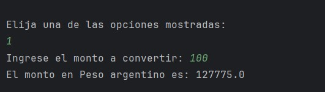
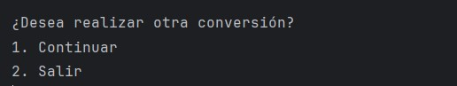
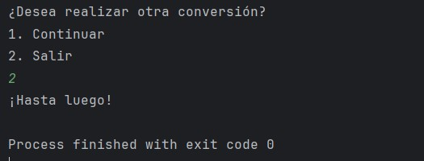

<h1 align="center" style="font-size: 50px;">💰 Conversor de Moneda 💰</h1>

<p align="center">
  
</p>

---

## 📌 **Índice**
1. [Descripción del Proyecto](#-descripción-del-proyecto)
2. [Estado del Proyecto](#-estado-del-proyecto)
3. [Características del Proyecto](#-características-del-proyecto)
4. [Tecnologías Utilizadas](#-tecnologías-utilizadas)
5. [Acceso al Proyecto](#-acceso-al-proyecto)
6. [Instrucciones para Ejecutar](#-instrucciones-para-ejecutar)
7. [Personas Desarrolladoras del Proyecto](#-personas-desarrolladoras-del-proyecto)
8. [Licencia](#-licencia)

---

## 📖 **Descripción del Proyecto**

Este es un **conversor de monedas** que permite a los usuarios convertir valores entre varias divisas utilizando tasas de cambio obtenidas de una API externa. Actualmente, soporta las siguientes monedas:

- Dólar estadounidense (USD)
- Peso argentino (ARS)
- Real brasileño (BRL)
- Peso colombiano (COP)
- Sol peruano (PEN)

El proyecto está hecho en **Java**, utilizando la biblioteca **Gson** para manejar la deserialización de los datos obtenidos de la API.

---

## 🚀 **Estado del Proyecto**

<h4 align="center">
🎉🚀 **Proyecto Completado** 🚀🎉
</h4>

---

## 🔧 **Características del Proyecto**

- **Interfaz de consola**: El menú se presenta en consola, permitiendo al usuario elegir entre varias opciones de conversión.
- **Soporte para múltiples monedas**: Se incluyen varias opciones de conversión, como Dólar a Peso argentino, Sol peruano a Dólar, entre otras.
- **Obtención de tasas de cambio en tiempo real**: El programa obtiene las tasas de cambio desde una API externa, lo que garantiza que las conversiones sean precisas y actualizadas.

### 📌 **Ejemplo de uso**:
**Ejemplo**:
1. El usuario ejecuta el programa y se le presenta el siguiente menú de opciones:

<p align="center">
  
</p>

2. Elige una opción, por ejemplo, **1) Dólar => Peso argentino**.
3. El programa solicita el **monto a convertir**. Si el usuario ingresa **100**, el programa realizará la conversión utilizando la tasa de cambio actual y mostrará:

<p align="center">
  
</p>

4. Después de mostrar el resultado de la conversión, el programa preguntará al usuario si desea realizar otra conversión o salir:

<p align="center">
  
</p>

5. Si el usuario elige 1 (Continuar), el menú se muestra de nuevo y puede elegir otra conversión. Si elige 2 (Salir), el programa se despide y termina:

<p align="center">
  
</p>

---

## 💻 **Tecnologías Utilizadas**

- **Java**: Lenguaje principal para el desarrollo.
- **Gson**: Biblioteca para manejar datos en formato JSON.
- **API de Exchange Rate**: API externa para obtener las tasas de cambio actuales.

---

## 📁 **Acceso al Proyecto**

1. **Clonar el Repositorio**:
   - `git clone https://github.com/JhairRoussell2/conversor-moneda.git`
   
2. **Abrir en IntelliJ IDEA**:
   - Abre el proyecto en **IntelliJ IDEA**.
   - Ejecuta la clase **`ConversorApp.java`**.

---

## 🛠️ **Instrucciones para Ejecutar**

1. Asegúrate de tener **Java 11** o superior instalado.
2. Si no tienes la biblioteca **Gson** instalada, añádela siguiendo estos pasos:
   - **Si usas Maven**, agrega esta dependencia en tu archivo `pom.xml`:
     ```xml
     <dependency>
         <groupId>com.google.code.gson</groupId>
         <artifactId>gson</artifactId>
         <version>2.10.1</version>
     </dependency>
     ```
   - **Si usas un archivo JAR**, descarga el JAR desde [Maven Central](https://mvnrepository.com/artifact/com.google.code.gson/gson) y añádelo al classpath de tu proyecto.

3. Corre la clase **`ConversorApp.java`**.

---

## 🧑‍💻 **Personas Desarrolladoras del Proyecto**

| [<br><sub>Jhair Roussell Melendez Blas</sub>](https://github.com/JhairRoussell2) |
| :---: |

---

## 📜 **Licencia**

Este proyecto está licenciado bajo la **Licencia MIT**.

